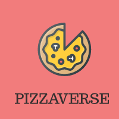

# PIZZAVERSE

It is a Pizza ordering website in which user can order a pizza and also admin have access to menu. He can add pizza, remove pizza and edit the pizza in the menu.

### TO-DO :

- [ ] Adding an Online Payment system.
- [ ] Improve Working Of Menu Button
- [ ] Adding SignUp/In option as per Need.
 
 
 
 <!-- PROJECT LOGO -->
<br />
<p align="center">
  <a href="https://github.com/othneildrew/Best-README-Template">
    <kbd></kbd>

  </a>

  <h3 align="center">Chat App</h3>

  <p align="center">
    <br />
    <a href="https://github.com/Kalaria-Bhargav/PIZZAVERSE/issues">Report Bug</a>
    ·
    <a href="https://github.com/Kalaria-Bhargav/PIZZAVERSE/issues">Request Feature</a>
  </p>
</p>

## About The Project

### Built With

* NextJs
* Javascript
* Zustand
* Sanity

## Getting Started

This is an example of how you may give instructions on setting up your project locally.
To get a local copy up and running follow these simple example steps.

### Installation


Fork, then download or clone the repo.
```bash
https://github.com/Kalaria-Bhargav/PIZZAVERSE.git
```

Open the project ,Install the dependencies via the terminal.
```bash
npm install
```
Open sanity folder by cd sanity, Install the dependencies via the terminal.
```bash
cd sanity
npm install
cd ..
```
Run the Project using Following Command Then Open [http://localhost:3000](http://localhost:3000)
```bash
npm run dev
```

!!Booyahhh, you can now play with project.

## Contributing

Any contributions you make are **Highly appreciated**.

1. Fork the Project
2. Create your Feature Branch (`git checkout -b feature/AmazingFeature`)
3. Commit your Changes (`git commit -m 'Add some AmazingFeature'`)
4. Push to the Branch (`git push origin feature/AmazingFeature`)
5. Open a Pull Request

## Live Project

[Link](https://pizzaverse-acfz4pl10-xxmagnetoxx.vercel.app)


